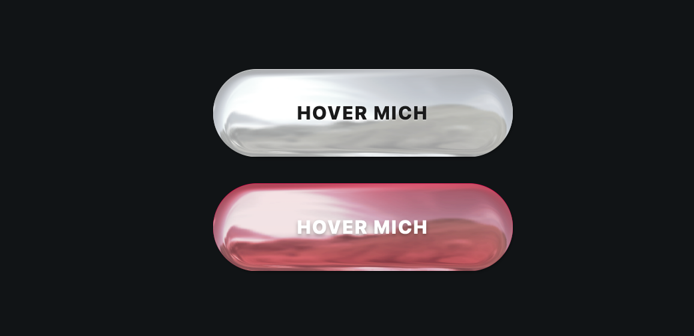

# ⚡ METALLIC CHROME BUTTONS

> Zwei ultra-realistische, interaktive 3D-Chrome-Buttons im Y2K- und Liquid-Metal-Cyberpunk-Style. Anisotrope Lichtbrechung trifft auf hochperformante CSS3-Animationen.

## 🚀 FEATURES

- **Physics-Based 3D-Shading:** Nutzt `metallicss.js` für echte mathematische Lichtreflexionen direkt auf dem Element.
- **DRY-Architecture:** Ein zentrales Basis-Styling (`.shiny-btn`) steuert die gesamte Physik und Animation. Null Code-Duplizierung.
- **Dynamic Glint Effect:** Ein scharfkantiger Lichtstrahl jagt bei `:hover` über die Wölbung und bleibt als dynamischer Reflex stehen.

---

## 🛠️ TECH STACK

- **HTML5** & **CSS3** (Custom Properties, Linear Gradients, Cubic-Bezier Easing)
- **[Metallicss](https://www.metallicss.com)** (SVG Displacement Maps & Filters via Web Components)

---